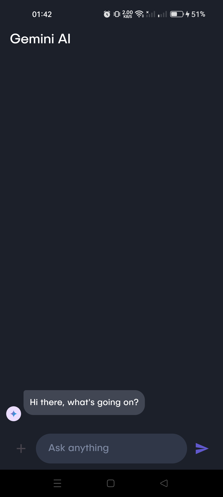
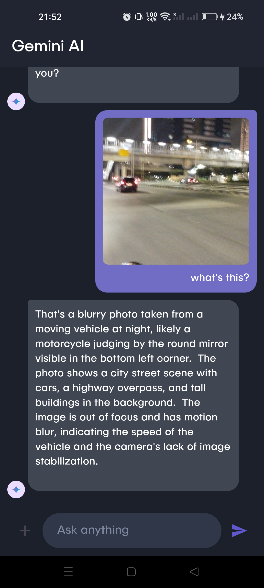

# 🤖 Gemini AI Chat  
A Flutter-based AI chat app powered by Gemini. Built with ❤️ using Flutter and Dart.

---

## 🚀 Features
✅ AI-powered responses using Gemini  
✅ Clean UI (optimized for Android)  
✅ Simple state management with `setState`  
✅ Image and text handling  

---

## ⚠️ Limitations
⚠️ Currently works only on **Android** (Not responsive on other platforms)  
⚠️ State management using `setState` (May update to Provider or Riverpod in future)  

---

## 🖥️ Screenshots
| Chat Interface |
|---------------|
|  |  |

---

## 📲 Installation
1. Clone the repository:
git clone https://github.com/anggtp/Gemini-Chat-App.git

2. Install dependencies:
flutter pub get

3. Run the app:
flutter run

## 🛠️ Built With
- Flutter
- Dart
- Gemini API (google_generative_ai: ^0.4.6)

## 🌟 Contributing
- Pull requests are welcome! If you find any issues, feel free to open an issue or create a pull request.
